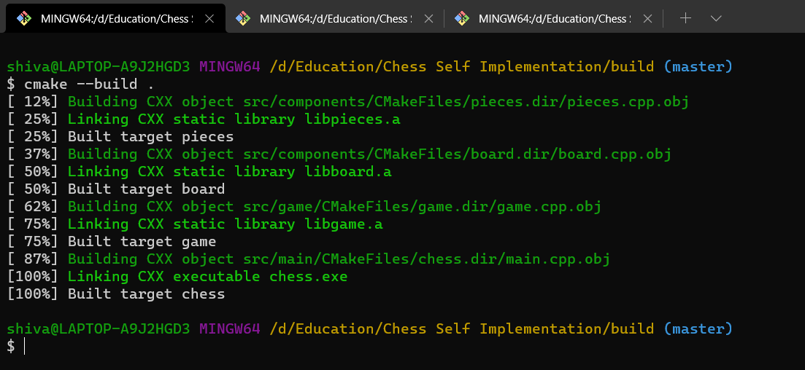
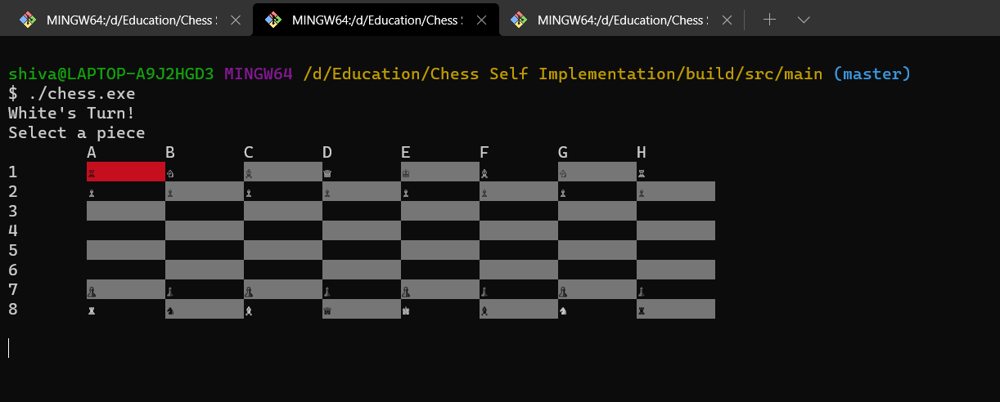
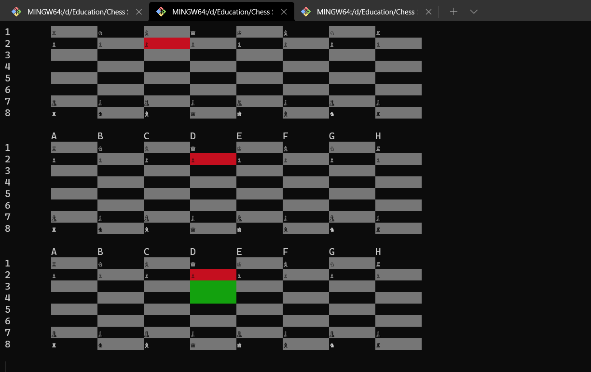
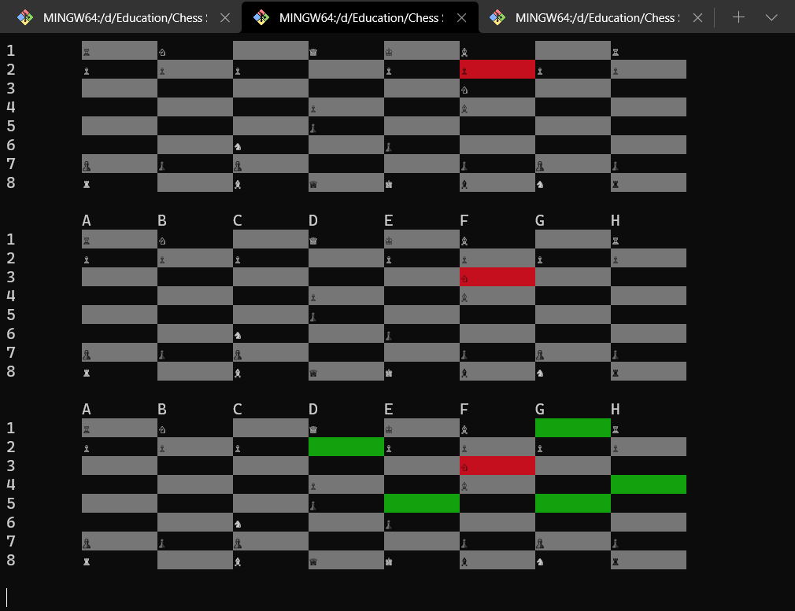
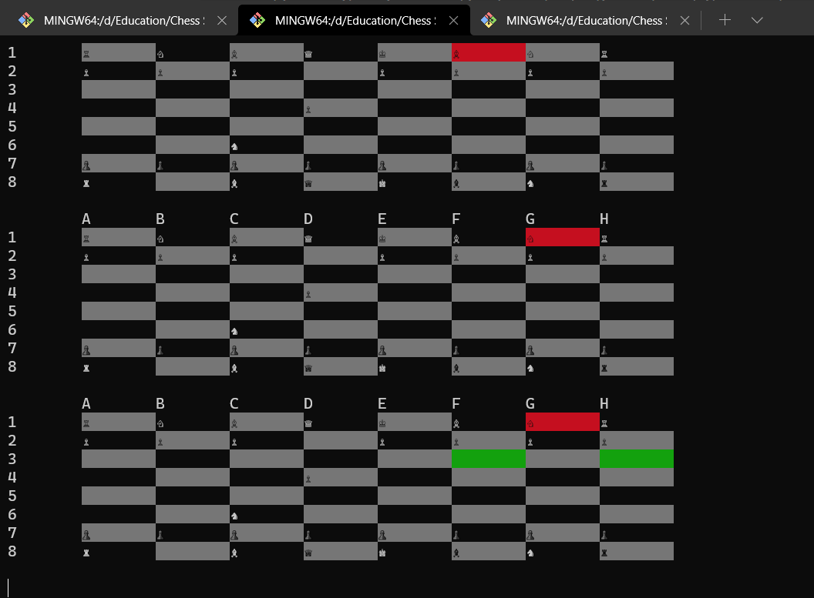
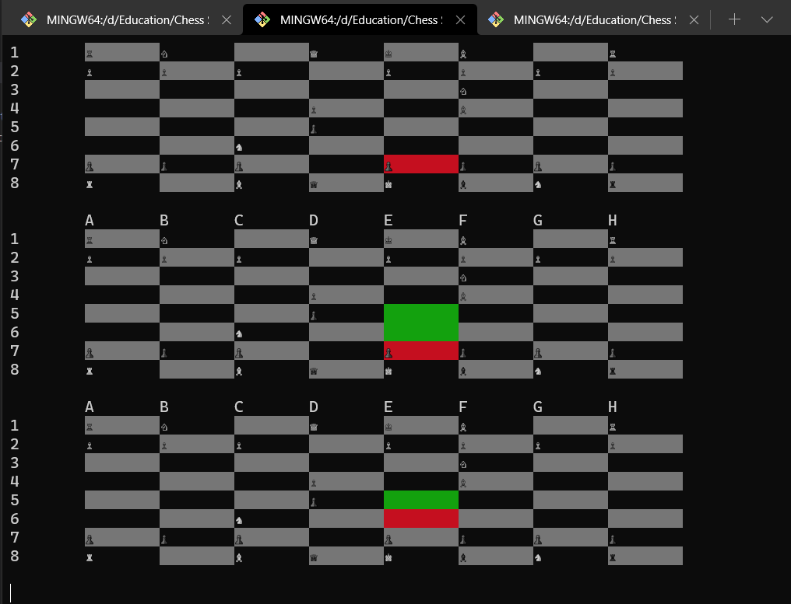

# Chess
This repository is my practice for understanding CMake and its usage to manage large projects.  
For this, I have modularised extensively, what seems to be overkill for a simple program such as Chess.  
This is all done for my understanding on the working of CMake in the process of building applications.  

## Build Instructions
Currently, only windows 10 is supported as Windows API functions have been used to display unicode symbols of the chess pieces and adding background colors to the board.  
In short, make a build directory inside the project folder, call cmake to configure in the build directory. Then build

```
mkdir build && cd build
cmake .. -G "MinGW Makefiles"
cmake --build .
```

Change the generator to whatever build system you prefer.  

### Build Output


## How the Game Works
#### Selecting a piece
Using arrow keys  


#### Possible Moves
The game displays possible moves after a selection has been made by highlighting it in green.  




#### Game Progression




#### Taking a Piece
If an opposing piece is on the path of the selected piece, it can take it as it will be highlighted as a possible move.  

